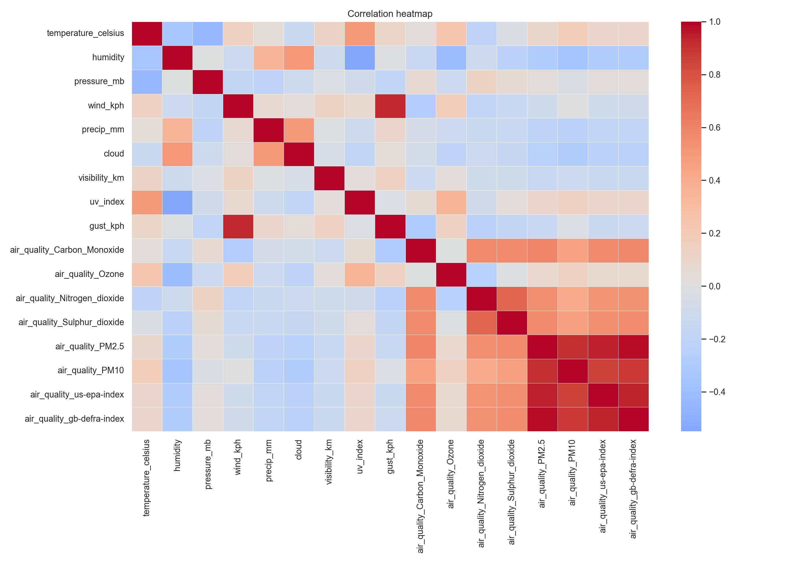
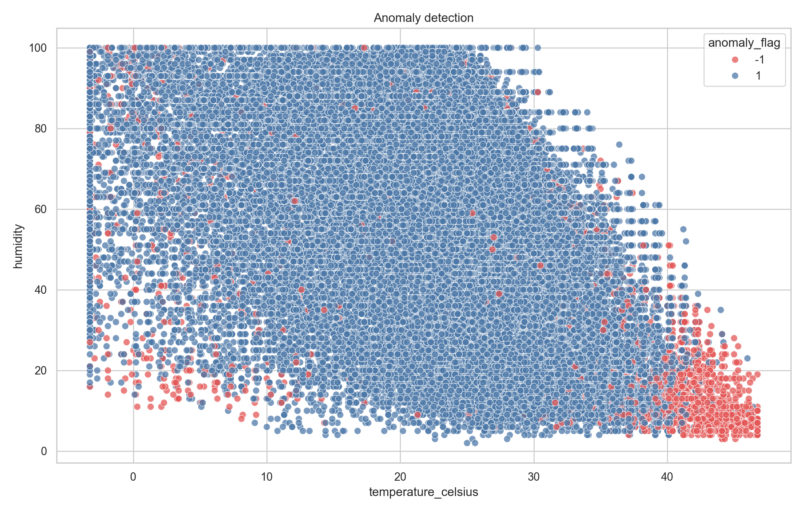
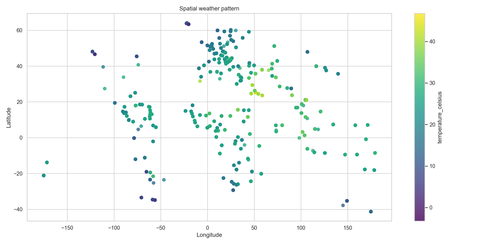
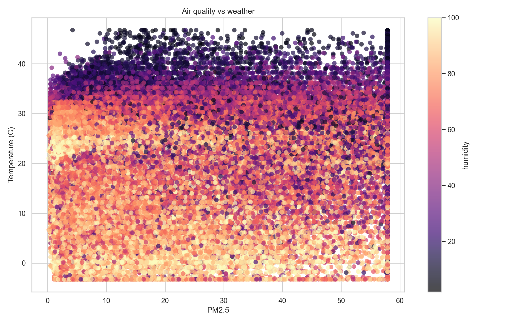
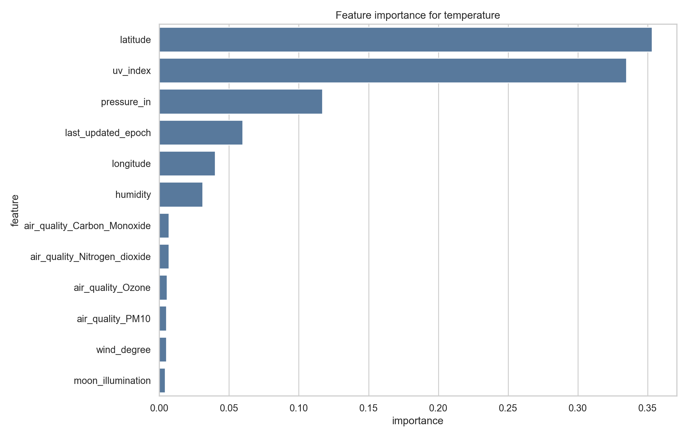
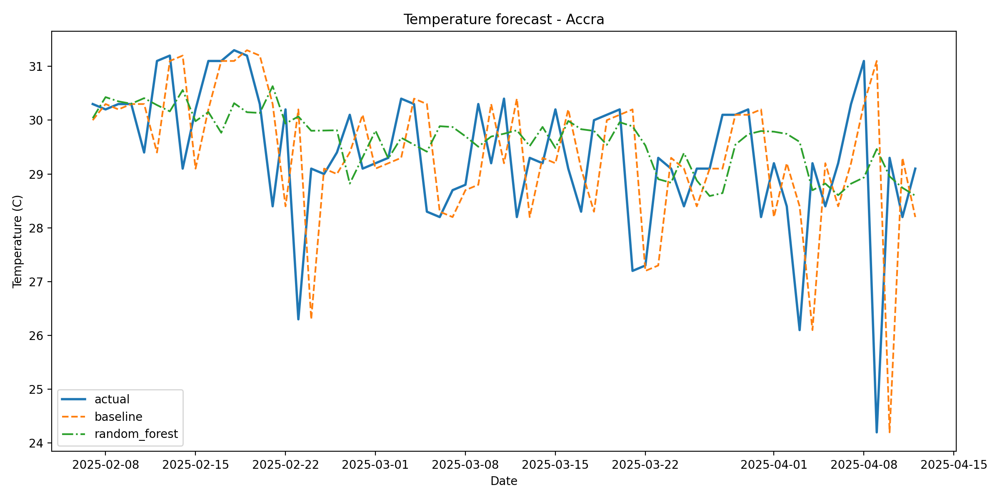

# Weather Trend Assessment

PM Accelerator mission: give everyone equal access to education.

## Scope

Dataset: `GlobalWeatherRepository.csv`

Outputs:
- `processed_weather.csv`
- `metrics.json`
- `visualizations/correlation_heatmap.png`
- `visualizations/anomaly_detection.png`
- `visualizations/spatial_weather_pattern.png`
- `visualizations/air_quality_vs_weather.png`
- `visualizations/feature_importance.png`
- `visualizations/forecast_actual_vs_predicted.png`

## Data Handling

- Numeric nulls: median imputation
- Categorical nulls: mode imputation, fallback `unknown`
- Outliers: IQR clipping on selected numeric fields
- Export: no derived scaling columns persisted

## Analysis Areas

- Correlation matrix on core weather and air-quality fields
- Isolation Forest on standardized weather and pollution variables
- Spatial pattern plot from latitude and longitude
- PM2.5 against temperature and humidity
- Random Forest feature ranking for `temperature_celsius`

## Forecasting

Time field: `last_updated`

Forecast target: daily average `temperature_celsius`

Forecast location: `Accra`

Models:
- Baseline: previous-day value
- Random Forest: lag and rolling-window features

Metrics:

- Baseline RMSE: 1.6606
- Baseline MAE: 1.1031
- Random Forest RMSE: 1.3450
- Random Forest MAE: 0.9755
- Train rows: 260
- Test rows: 65

Random Forest outperformed the baseline on both metrics.

## Visual Outputs

### Correlation Heatmap

### Anomaly Detection

### Spatial Weather Pattern

### Air Quality vs Weather

### Feature Importance

### Forecast Performance

## Run Order

1. `python 01_data_preprocessing.py`
2. `python 02_eda_and_analysis.py`
3. `python 03_forecasting_models.py`
